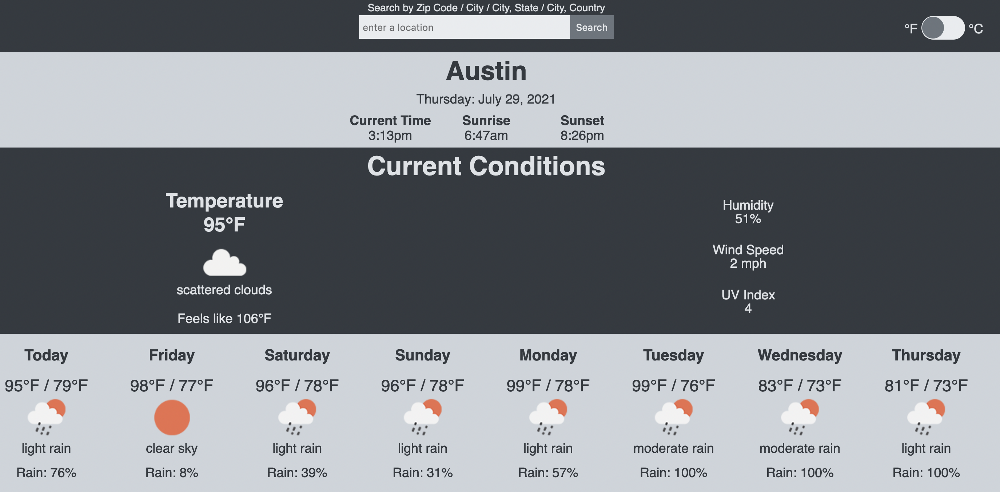

# weather app

this is project 5 from the odin project's full stack javascript course

## project objectives

1. fetch data from the OpenWeather API based on a user's input
2. process the JSON data from the API and render the desired data to the page
3. allow user to toggle between metric and imperial units

## app features

1. first section displays the city, date, time, and the times of sunrise/sunset
2. second section displays current conditions like temperature, weather conditions, humidity, UV index, and wind speed
3. third section displays the week's forecast
4. built a toggle switch to convert between metric/imperial units
5. built a search bar for user to input a desired location in several format, like by zip code or city

## areas for improvement

1. the overall aesthetic could be dramatically improved upon. i like its general simplicity but the spacing needs improvement.
2. adding the state and country would make it more clear which city is displayed. for example, is it Paris, TX or Paris, France?
3. media queries are needed for improved responsiveness. as an example, could opt to fix the forecast section as a percentage of the width and add a scrollbar.

## live version

[click here](https://jernestmyers.github.io/weather-app/) for a live version!

## technologies used

HTML5 / CSS3 / JavaScript / webpack / ESLint / OpenWeather API
